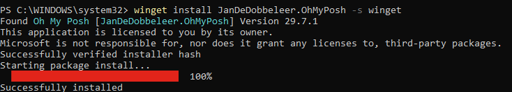

# OhMyZsh-for-Windows



Open Powershell as adminstrator and run:

```
winget install JanDeDobbeleer.OhMyPosh -s winget
```

Then run this command and select - Meslo
```
oh-my-posh font install
```
